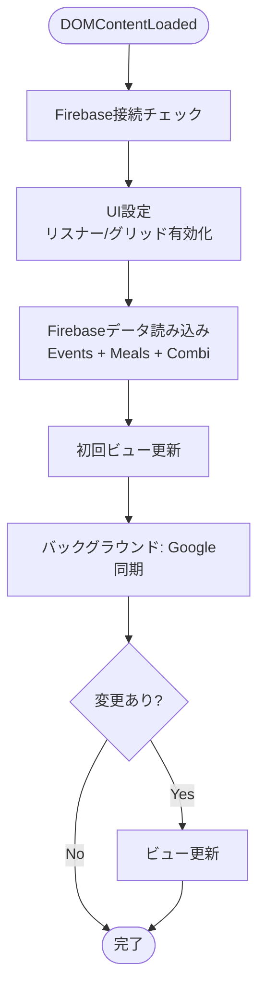
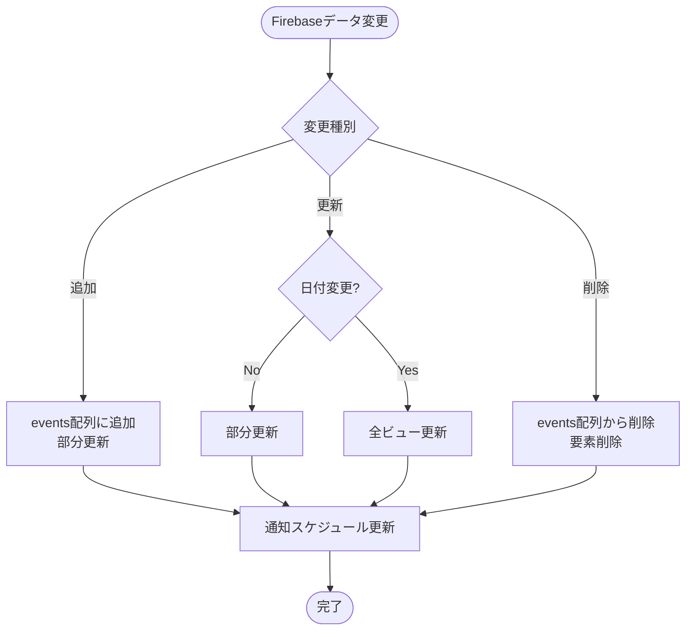
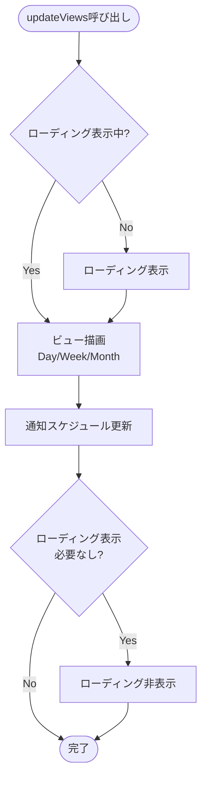
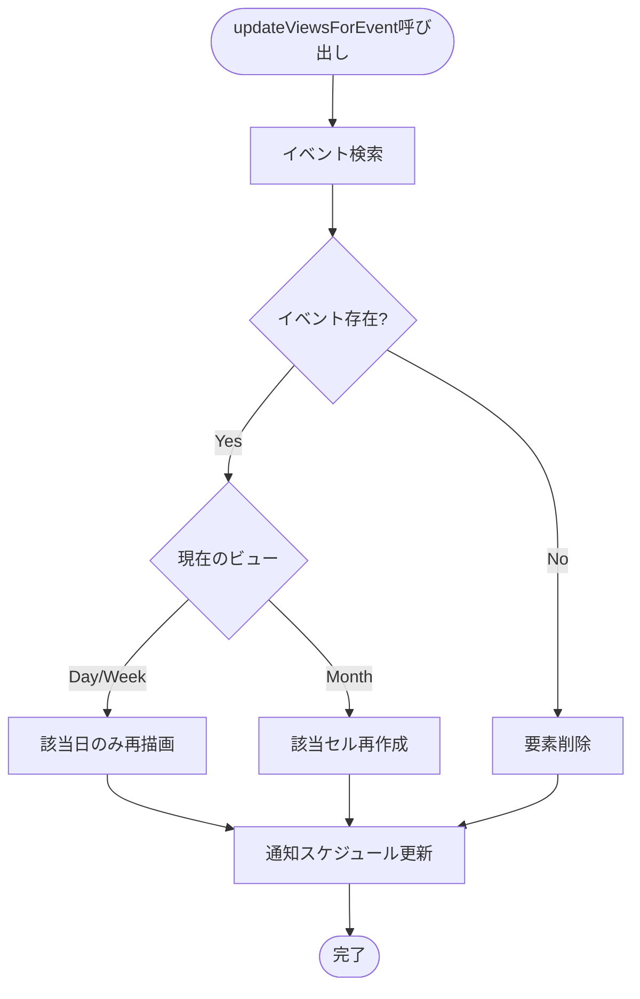
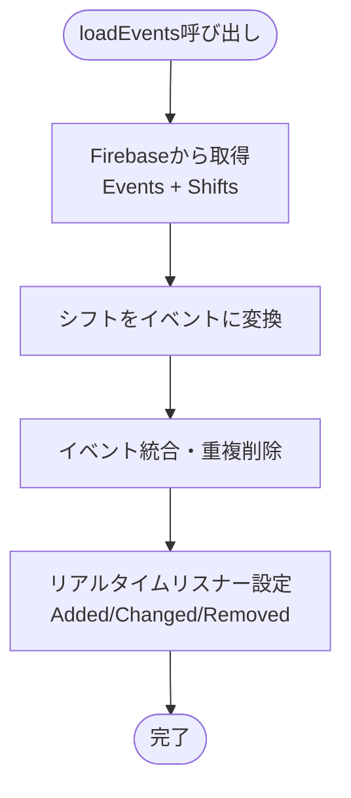
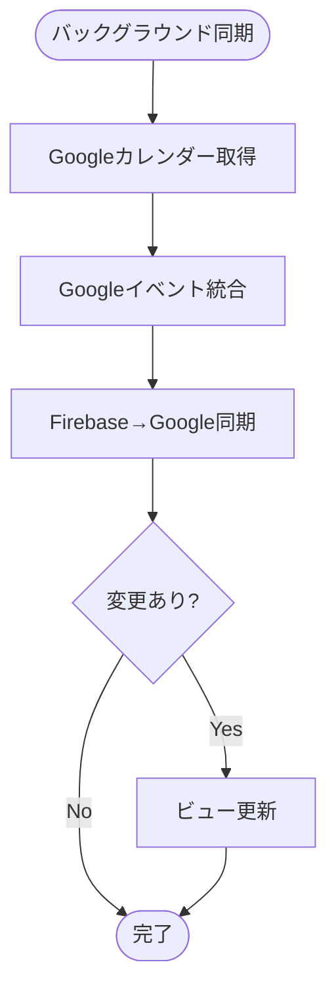
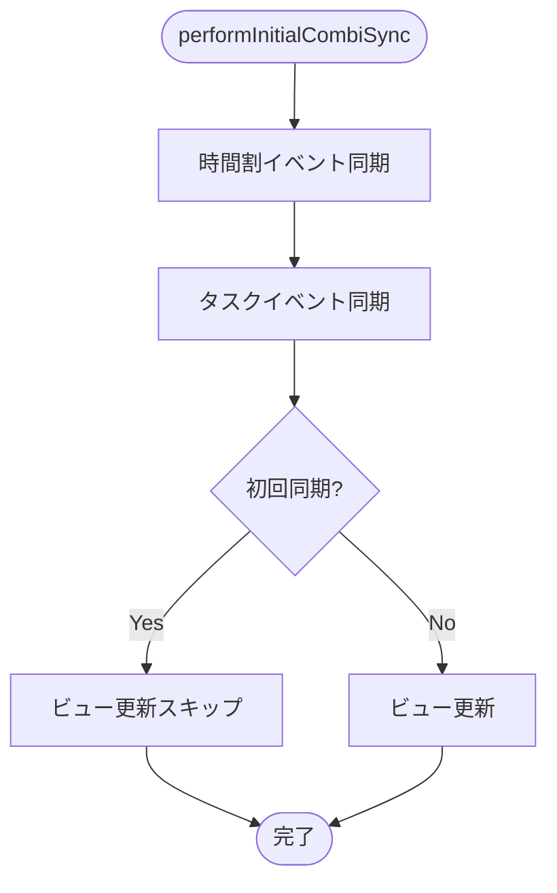

# データ初期化・更新フローチャート

## 1. アプリケーション初期化フロー

## 2. リアルタイム更新フロー（Firebaseリスナー）

## 3. ビュー更新フロー（updateViews）

## 4. 部分更新フロー（updateViewsForEvent）

## 5. データ読み込みフロー（loadEvents）

## 6. Google同期フロー（バックグラウンド）

## 7. Combi同期フロー

