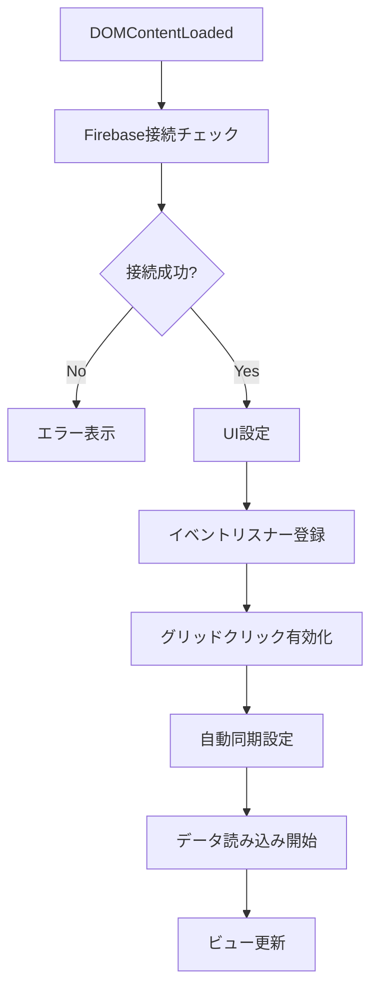
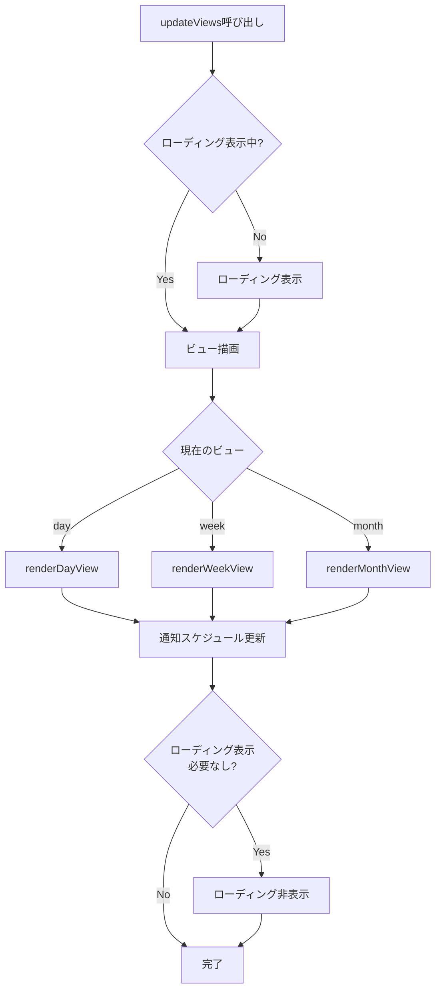
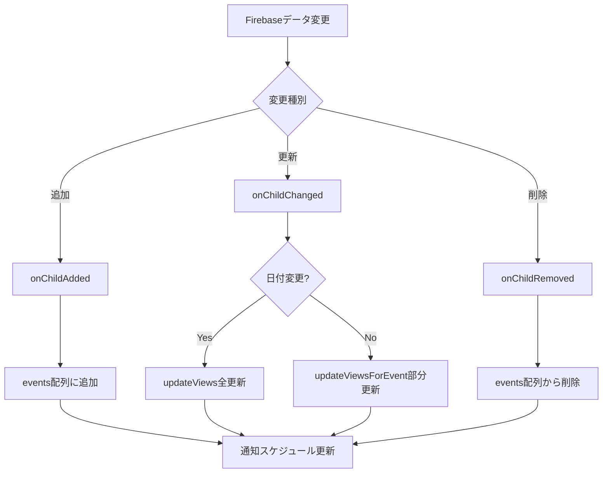
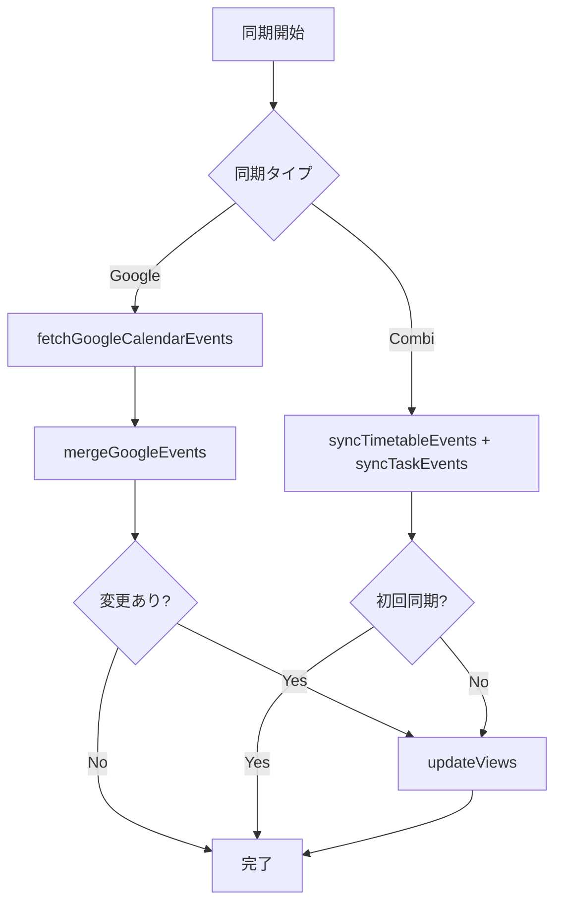

# スケジュール管理アプリ - ロジック整理ドキュメント

## 目次

1. [アーキテクチャ概要](#アーキテクチャ概要)
2. [データ構造](#データ構造)
3. [初期化フロー](#初期化フロー)
4. [データ読み込み](#データ読み込み)
5. [ビュー管理](#ビュー管理)
6. [イベント管理](#イベント管理)
7. [同期機能](#同期機能)
8. [UI操作](#ui操作)
9. [ユーティリティ関数](#ユーティリティ関数)

---

## アーキテクチャ概要

### 技術スタック
- **フロントエンド**: Vanilla JavaScript (ES6+)
- **バックエンド**: Firebase Realtime Database
- **外部連携**: Google Calendar API (Google Apps Script経由)
- **統合アプリ**: 
  - `diet_mgr` (食事管理) - Firebase経由
  - `combi` (学習管理) - Firebase経由
  - `pt` (シフト管理) - Firebase経由

### 主要コンポーネント

```
┌─────────────────────────────────────────┐
│         index.html (UI構造)              │
│  - ヘッダー（日付ナビゲーション）          │
│  - 日次/週次/月次ビュー                   │
│  - イベント編集モーダル                   │
└─────────────────────────────────────────┘
                    ↓
┌─────────────────────────────────────────┐
│         app.js (ロジック層)              │
│  - データ管理                            │
│  - ビュー描画                            │
│  - 同期処理                              │
│  - UI操作                                │
└─────────────────────────────────────────┘
                    ↓
┌─────────────────────────────────────────┐
│      Firebase Realtime Database         │
│  - events (イベントデータ)               │
│  - shifts (シフトデータ)                 │
│  - workplaces (職場データ)               │
└─────────────────────────────────────────┘
                    ↓
┌─────────────────────────────────────────┐
│      Google Calendar (同期)              │
│  - Google Apps Script経由               │
└─────────────────────────────────────────┘
```

---

## データ構造

### グローバル変数

```javascript
// イベントデータ
let events = [];                    // 全イベント配列
let mealEvents = [];                // 食事イベント（統合前）
let currentDate = new Date();       // 現在表示中の日付
let currentView = 'day';            // 'day' | 'week' | 'month'

// Firebase関連
let isFirebaseEnabled = false;
let dietDatabase = null;            // diet_mgr用Firebase
let workplaces = [];                 // ptプロジェクトの職場データ

// 同期関連
let googleSyncIntervalId = null;
let googleSyncTimeoutId = null;
let googleSyncInFlight = false;

// リスナー管理
let unsubscribeEvents = null;
let unsubscribeChildAdded = null;
let unsubscribeChildChanged = null;
let unsubscribeChildRemoved = null;
// ... (その他のリスナー)

// ビューキャッシュ
const viewCaches = {
  day: { allDay: Map, timed: Map },
  week: { allDay: Array(7), timed: Array(7) }
};
```

### イベントオブジェクト構造

```javascript
{
  id: string,                    // Firebase生成ID
  title: string,                 // タイトル
  startTime: string,             // ISO 8601形式
  endTime: string,               // ISO 8601形式
  allDay: boolean,               // 終日フラグ
  description: string,           // 説明
  color: string,                 // カラーコード (#3b82f6)
  reminderMinutes: number,       // 通知時間（分）
  recurrence: string,            // 'none' | 'daily' | 'weekly' | 'monthly'
  recurrenceEnd: string,         // 繰り返し終了日
  
  // メタデータ
  source: string,                // 'local' | 'google' | 'shift' | 'combi-timetable' | 'combi-task' | 'meal'
  isTimetable: boolean,          // 時間割イベントフラグ
  isGoogleImported: boolean,     // Googleからインポート
  googleEventId: string,         // Google Calendar ID
  
  // シフト関連
  workplaceId: string,           // 職場ID
  shiftId: string,               // シフトID
  
  // タイムスタンプ
  createdAt: string,              // 作成日時
  updatedAt: string,              // 更新日時
  lastWriteClientId: string       // 最後に書き込んだクライアントID
}
```

---

## 初期化フロー

### 1. DOMContentLoaded イベント



### 初期化処理の詳細

**ファイル**: `app.js` (line 4819-4888)

```javascript
document.addEventListener('DOMContentLoaded', async function() {
  // 1. Firebase接続チェック
  showLoading('Firebase接続中...');
  const firebaseReady = await waitForFirebase(10000);
  if (!firebaseReady) {
    hideLoading();
    showMessage('Firebaseの初期化に失敗しました。', 'error');
    return;
  }
  hideLoading();

  // 2. UI設定
  setupEventListeners();              // イベントリスナー登録
  enableDayGridClickToCreate();       // 日次グリッドクリック
  enableWeekGridClickToCreate();      // 週次グリッドクリック

  // 3. 自動同期設定
  startAutomaticGoogleSync();          // Google同期（5分間隔）
  const performInitialCombiSync = setupCombiAutoSync(); // Combi同期設定

  // 4. データ読み込み（非同期）
  (async function() {
    await loadEvents();                // イベント読み込み
    await loadMealData();              // 食事データ読み込み
    integrateMealEvents();             // 食事イベント統合
    if (performInitialCombiSync) {
      await performInitialCombiSync();  // Combi初回同期
    }
    showLoading('データを反映中...');
    updateViews();                     // 初回ビュー更新
    hideLoading();
  })();

  // 5. バックグラウンドGoogle同期（初期化後5秒）
  setTimeout(() => {
    fetchGoogleCalendarEvents({ silent: true });
  }, INITIAL_GOOGLE_SYNC_DELAY_MS);
});
```

---

## データ読み込み

### 1. イベント読み込み (`loadEvents`)

**ファイル**: `app.js` (line 520-1058)

**処理フロー**:
1. Firebase接続確認
2. 既存リスナー解除
3. イベントデータ取得（`events` ノード）
4. シフトデータ取得（`shifts` ノード）→ イベント変換
5. リアルタイムリスナー設定
   - `onChildAdded`: 新規追加
   - `onChildChanged`: 更新
   - `onChildRemoved`: 削除
6. 重複削除処理

**主要関数**:
- `normalizeEventFromSnapshot()`: Firebaseスナップショットを正規化
- `convertShiftToEvent()`: シフトデータをイベントに変換
- `deduplicateFirebaseEvents()`: 重複イベント削除

### 2. 食事データ読み込み (`loadMealData`)

**ファイル**: `app.js` (line 379-433)

**処理フロー**:
1. `diet_mgr` のFirebase初期化（別アプリインスタンス）
2. `inventory` データ取得（食事名マッピング）
3. `weeklyPlan` データ取得
4. 週次プランをイベントに変換
5. `mealEvents` 配列に格納

**主要関数**:
- `convertWeeklyPlanToEvents()`: 週次プラン→イベント変換

### 3. 食事イベント統合 (`integrateMealEvents`)

**ファイル**: `app.js` (line 504-519)

**処理**:
- `mealEvents` を `events` 配列に統合
- 重複チェック（日付+タイトル）

### 4. Combiデータ同期 (`setupCombiAutoSync`)

**ファイル**: `app.js` (line 4550-4660)

**処理フロー**:
1. 初回同期実行
   - `syncTimetableEvents()`: 時間割イベント同期
   - `syncTaskEvents()`: タスクイベント同期
2. リアルタイムリスナー設定
   - `semesters` ノード監視
   - `tasks` ノード監視
3. 変更検知時にデバウンス付き同期（1秒後）

**主要関数**:
- `loadCombiData()`: Combiデータ読み込み
- `syncTimetableEvents()`: 時間割→イベント変換
- `syncTaskEvents()`: タスク→イベント変換

---

## ビュー管理

### ビュー更新フロー



### 1. 日次ビュー (`renderDayView`)

**ファイル**: `app.js` (line 2255-2308)

**処理**:
1. 終日イベント取得・表示
2. 時間指定イベント取得・表示
3. イベント要素作成・配置
4. リサイズハンドル付与

**主要関数**:
- `getEventsByDate()`: 指定日のイベント取得
- `splitEventsByAllDay()`: 終日/時間指定で分割
- `createEventElement()`: イベント要素作成
- `positionEventInDayView()`: イベント位置計算

### 2. 週次ビュー (`renderWeekView`)

**ファイル**: `app.js` (line 2309-2439)

**処理**:
1. 週の開始日計算
2. 各日のヘッダー更新
3. 各日の終日イベント表示
4. 各日の時間指定イベント表示
5. イベント重複処理（グループ化）

**主要関数**:
- `getWeekStart()`: 週の開始日取得
- `getEventsByWeek()`: 週のイベント取得
- `calculateEventGroups()`: イベント重複グループ計算
- `applyOverlapStyles()`: 重複スタイル適用

### 3. 月次ビュー (`renderMonthView`)

**ファイル**: `app.js` (line 3059-3131)

**処理**:
1. 月のグリッド生成（6週分）
2. 各日のセル作成
3. 各日のイベント表示（最大3件+「+N」）
4. 今日/他月のスタイル適用

**主要関数**:
- `createMonthDayElement()`: 日セル作成
- `getEventsByDate()`: 指定日のイベント取得

### 部分更新 (`updateViewsForEvent`)

**ファイル**: `app.js` (line 3271-3295)

**処理**:
- 特定イベントのみ更新（効率化）
- ビューに応じて部分再描画
  - Day/Week: 該当日のみ
  - Month: 該当セル再作成

**主要関数**:
- `updateDayViewForEvent()`: 日次ビュー部分更新
- `updateWeekViewForEvent()`: 週次ビュー部分更新
- `updateMonthViewForEvent()`: 月次ビュー部分更新
- `removeEventElement()`: イベント要素削除

---

## イベント管理

### 1. イベント追加 (`addEvent`)

**ファイル**: `app.js` (line 1799-1891)

**処理フロー**:
1. イベントデータ正規化
2. Google同期オプション確認
3. Firebaseに保存
   - Google同期あり: 先にGoogle同期 → 成功時のみFirebase保存
   - Google同期なし: 直接Firebase保存
4. リアルタイムリスナーが自動的に `events` 配列を更新

**主要関数**:
- `normalizeEventData()`: イベントデータ正規化
- `mirrorMutationsToGoogle()`: Google同期

### 2. イベント更新 (`updateEvent`)

**ファイル**: `app.js` (line 1894-1973)

**処理フロー**:
1. 既存イベント取得
2. 更新データ正規化
3. 日付変更チェック
4. Firebase更新
5. Google同期（オプション）
6. ビュー更新（日付変更時は全更新、それ以外は部分更新）

### 3. イベント削除 (`deleteEvent`)

**ファイル**: `app.js` (line 1974-2026)

**処理フロー**:
1. イベント存在確認
2. Google同期（オプション）
3. Firebase削除
4. リアルタイムリスナーが自動的に `events` 配列から削除

### 4. イベント要素操作

**ファイル**: `app.js` (line 2592-2690)

**主要関数**:
- `createEventElement()`: イベント要素作成
- `populateEventElement()`: イベントデータを要素に反映
- `bindEventElementInteractions()`: クリック/キーボードイベント
- `syncEventElements()`: 要素の同期（追加/更新/削除）

---

## 同期機能

### 1. Google Calendar同期

#### Firebase → Google (`syncEventsToGoogleCalendar`)

**ファイル**: `app.js` (line 1211-1323)

**処理**:
1. 同期対象イベントフィルタリング
   - `source !== 'google'`
   - `isTimetable !== true`
   - 日付範囲内
2. Google Apps ScriptにPOST
3. 結果表示

#### Google → Firebase (`fetchGoogleCalendarEvents`)

**ファイル**: `app.js` (line 1325-1388)

**処理**:
1. Google Apps ScriptからGET
2. `mergeGoogleEvents()` で統合
3. 重複削除
4. ビュー更新

#### イベント統合 (`mergeGoogleEvents`)

**ファイル**: `app.js` (line 1543-1746)

**処理**:
1. 既存イベントを `googleEventId` でマッピング
2. 日付+タイトルで重複チェック
3. 新規/更新/スキップ判定
4. Firebase更新/追加

**重複判定ロジック**:
- `googleEventId` 一致 → 更新判定
- 日付+タイトル一致 → 重複スキップ

#### 自動同期

**ファイル**: `app.js` (line 2083-2120)

**処理**:
- 5分間隔で自動実行
- `fetchGoogleCalendarEvents({ silent: true })`
- `syncEventsToGoogleCalendar({ silent: true })`

### 2. Combi同期

#### 時間割同期 (`syncTimetableEvents`)

**ファイル**: `app.js` (line 4317-4442)

**処理**:
1. 学期データ取得
2. 既存の `combi-timetable` イベント削除
3. 授業日 × 時間割でイベント生成
4. Firebaseに保存（`syncGoogle: false`）

#### タスク同期 (`syncTaskEvents`)

**ファイル**: `app.js` (line 4444-4548)

**処理**:
1. タスクデータ取得
2. 既存の `combi-task` イベント削除
3. 未完了タスクのみ終日イベント生成
4. Firebaseに保存（`syncGoogle: false`）

### 3. 食事データ統合

**処理**:
- `loadMealData()` で読み込み
- `integrateMealEvents()` で統合
- リアルタイム更新なし（週次プランは手動更新想定）

### 4. シフトデータ統合

**処理**:
- `loadEvents()` 内で `shifts` ノードを監視
- シフト変更時に自動的にイベント変換
- 職場色を自動適用

---

## UI操作

### 1. イベント編集モーダル

**ファイル**: `app.js` (line 2828-3040)

**主要関数**:
- `showEventModal(eventId)`: モーダル表示
- `closeEventModal()`: モーダル閉じる
- フォーム送信処理

**処理**:
1. 新規/編集モード判定
2. フォーム初期化
3. バリデーション
4. `addEvent()` / `updateEvent()` 呼び出し

### 2. 日次グリッド操作 (`enableDayGridClickToCreate`)

**ファイル**: `app.js` (line 5488-5606)

**処理**:
1. マウスダウン: 範囲選択開始
2. マウスムーブ: 選択範囲プレビュー
3. マウスアップ: イベント作成モーダル表示

### 3. 週次グリッド操作 (`enableWeekGridClickToCreate`)

**ファイル**: `app.js` (line 5641-5673)

**処理**:
- 日次グリッドと同様
- クリックした日の日付を設定

### 4. イベントドラッグ&リサイズ (`attachResizeHandlers`)

**ファイル**: `app.js` (line 5674-6101)

**処理**:
1. リサイズハンドル（上下）: 開始/終了時間変更
2. イベント本体ドラッグ: 時間移動
3. タッチイベント対応（モバイル）

**制約**:
- 終日イベント: リサイズ不可
- `isTimetable === true`: 編集不可
- モバイル: リサイズハンドル非表示

### 5. ビュー切り替え

**処理**:
- 日次/週次/月次ボタンクリック
- `currentView` 更新
- `updateViews()` 呼び出し

### 6. 日付ナビゲーション

**処理**:
- 前日/翌日ボタン
- 今日ボタン
- `currentDate` 更新
- `updateViews()` 呼び出し

---

## ユーティリティ関数

### 日付処理

```javascript
// 日付のみ取得（YYYY-MM-DD）
formatDateOnly(dateString)

// 週の開始日取得（月曜日）
getWeekStart(date)

// 日付範囲チェック
isEventInAllowedRange(event, ranges)

// 許可された日付範囲取得
getAllowedDateRanges()
```

### イベント処理

```javascript
// 終日イベント判定
isAllDayEvent(event)

// イベント正規化
normalizeEventData(event)
normalizeEventFromSnapshot(snapshot, key)

// イベント検索
getEventsByDate(date)
getEventsByWeek(startDate)
```

### 型チェック

```javascript
isArray(value)
isString(value)
isObject(value)
isDate(value)
isValidDateString(value)
isValidEventId(id)
```

### DOM操作

```javascript
// 安全な要素取得
safeGetElementById(id)

// ローディング表示
showLoading(message)
hideLoading()

// メッセージ表示（現在は無効化）
showMessage(message, type, duration)

// 確認モーダル
showConfirmModal(message, title)
```

### 通知管理

```javascript
// 全通知スケジュール更新
scheduleAllNotifications()

// 個別通知スケジュール
scheduleNotification(event)
```

---

## データフロー図

### リアルタイム更新フロー



### 同期フロー



---

## エラーハンドリング

### エラー処理方針

1. **Firebase接続エラー**: ユーザーに通知、再試行推奨
2. **Google同期エラー**: エラーログ、Firebase保存は継続
3. **データ読み込みエラー**: 部分的なデータ表示継続
4. **ビュー描画エラー**: エラーログ、前の状態を維持

### ログ出力

- プレフィックス付きログ（例: `[INIT:EVENTS]`, `[GOOGLE:FETCH]`）
- エラーは `console.error()` で出力
- デバッグ情報は `console.log()` で出力

---

## パフォーマンス最適化

### 1. ビューキャッシュ

- `viewCaches`: イベント要素のキャッシュ
- 部分更新時に再利用

### 2. 部分更新

- 日付変更時のみ全更新
- 同一日付内の変更は部分更新

### 3. デバウンス

- Combi同期: 1秒デバウンス
- Google同期: 5分間隔

### 4. 範囲制限

- 表示範囲外のイベントは読み込まない
- `getAllowedDateRanges()` で範囲制限

---

## セキュリティ・整合性

### 1. クライアントID

- 各クライアントに一意IDを付与
- `lastWriteClientId` で無限ループ防止

### 2. 重複防止

- `deduplicateFirebaseEvents()`: 重複イベント削除
- 日付+タイトルで重複判定

### 3. データ正規化

- すべてのイベントデータを正規化
- 型チェックを厳密に実施

---

## 今後の拡張ポイント

1. **オフライン対応**: Service Worker導入
2. **通知改善**: ブラウザ通知API活用
3. **パフォーマンス**: 仮想スクロール導入
4. **アクセシビリティ**: ARIA属性強化
5. **テスト**: ユニットテスト・E2Eテスト追加

---

## 関連ファイル

- `app.js`: メインロジック（約6,000行）
- `index.html`: UI構造
- `styles.css`: スタイル定義
- `FLOWCHARTS.md`: フローチャート（既存）

---

**最終更新**: 2024年
**バージョン**: 1.0
