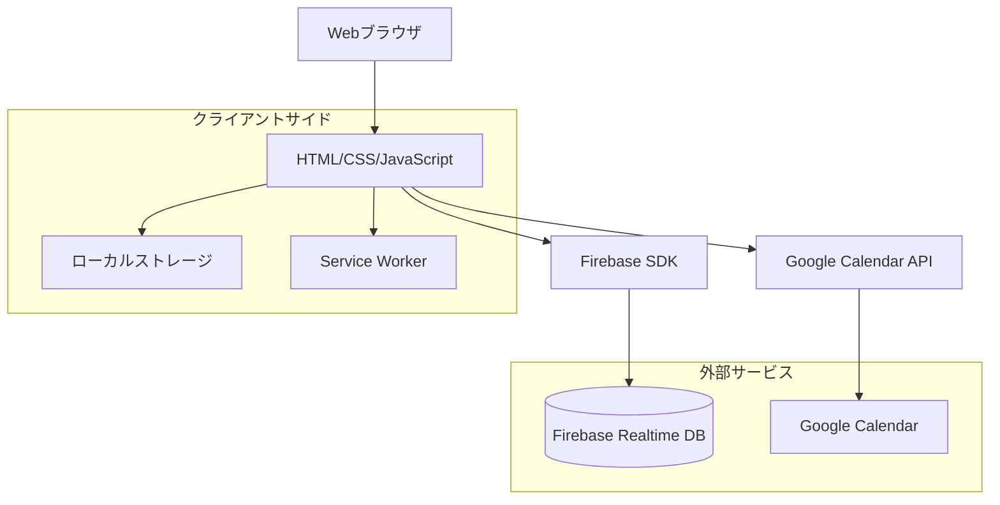
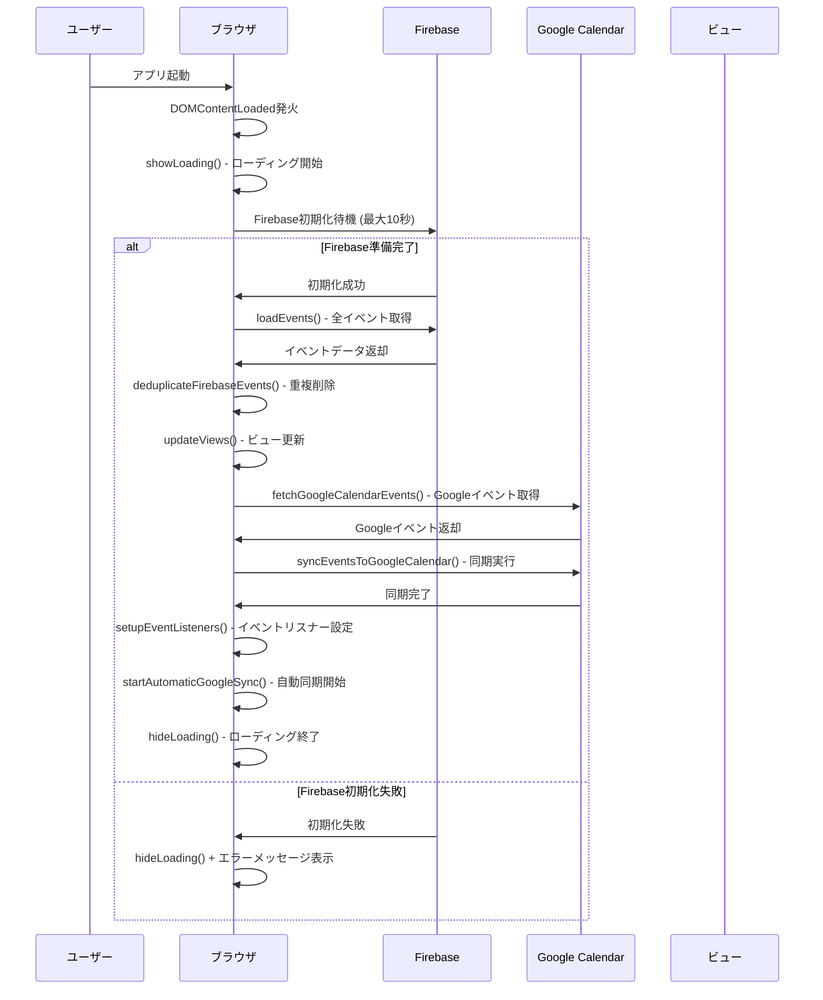
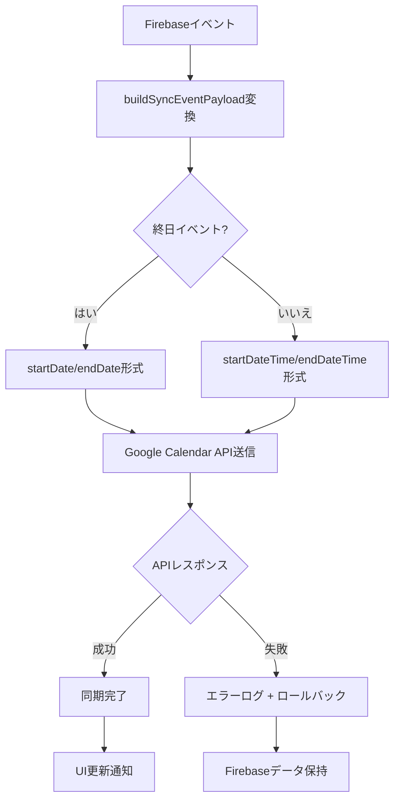
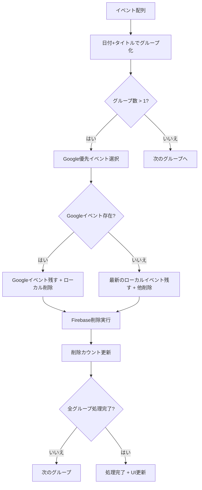
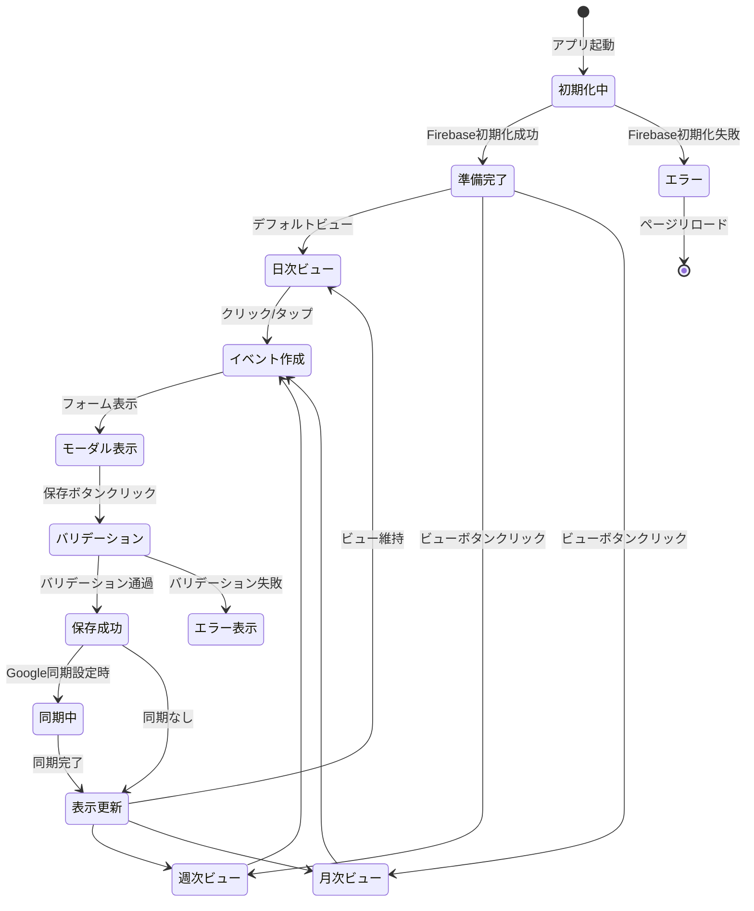
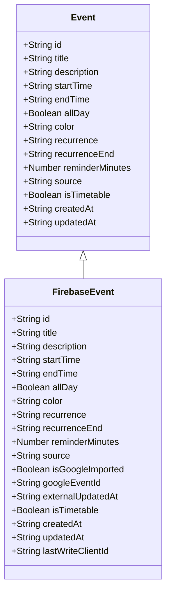

# スケジュール管理アプリ詳細ロジック

## 概要

このスケジュール管理アプリは、Firebase Realtime DatabaseとGoogle Calendarを連携させたWebアプリケーションです。主な機能として、スケジュールのCRUD操作、複数ビュー表示、重複削除処理、リアルタイム同期などが実装されています。

## アーキテクチャ概要



## 初期化シーケンス



## CRUD操作フロー

### Create操作（イベント作成）

```mermaid
flowchart TD
    A[ユーザークリック/フォーム送信] --> B{終日イベント?}
    B -->|はい| C[openAllDayCreateModal]
    B -->|いいえ| D[通常モーダル表示]

    C --> E[日付入力フィールド表示]
    D --> F[時間入力フィールド表示]

    E --> G[フォーム入力]
    F --> G

    G --> H{バリデーション}
    H -->|成功| I[addEvent() - Firebase保存]
    H -->|失敗| J[エラーメッセージ表示]

    I --> K{Google同期設定?}
    K -->|はい| L[mirrorMutationsToGoogle - Google保存]
    K -->|いいえ| M[ローカル保存完了]

    L --> N[リアルタイムリスナー発火]
    M --> N

    N --> O[UI更新 + 成功メッセージ]
```

### Update操作（イベント編集）

```mermaid
flowchart TD
    A[イベントクリック] --> B[showEventModal - 編集モード]
    B --> C[既存データ読み込み]
    C --> D{終日イベント?}

    D -->|はい| E[日付フィールド表示 + 時間フィールド非表示]
    D -->|いいえ| F[時間フィールド表示 + 日付フィールド非表示]

    E --> G[データ編集]
    F --> G

    G --> H{変更検知}
    H -->|変更なし| I[モーダル閉じる]
    H -->|変更あり| J[バリデーション]

    J -->|成功| K[updateEvent() - Firebase更新]
    J -->|失敗| L[エラーメッセージ表示]

    K --> M{Google同期設定?}
    M -->|はい| N[mirrorMutationsToGoogle - Google更新]
    M -->|いいえ| O[ローカル更新完了]

    N --> P[リアルタイムリスナー発火]
    O --> P

    P --> Q[UI更新 + 成功メッセージ]
```

## データ同期ロジック

### Firebase-Google Calendar同期フロー



### 重複削除処理



## UI状態遷移



## データ構造

### イベントオブジェクト構造



## 主要関数一覧

### 初期化関連
- `DOMContentLoaded` イベントハンドラ
- `waitForFirebase()` - Firebase初期化待機
- `loadEvents()` - Firebaseからイベント読み込み
- `setupEventListeners()` - UIイベント設定

### CRUD操作
- `addEvent()` - イベント作成
- `updateEvent()` - イベント更新
- `deleteEvent()` - イベント削除

### データ同期
- `mirrorMutationsToGoogle()` - Google Calendar同期
- `fetchGoogleCalendarEvents()` - Googleからイベント取得
- `syncEventsToGoogleCalendar()` - Firebase→Google同期
- `deduplicateFirebaseEvents()` - 重複削除

### UI関連
- `updateViews()` - 全ビュー更新
- `renderDayView()` - 日次ビュー描画
- `renderWeekView()` - 週次ビュー描画
- `renderMonthView()` - 月次ビュー描画
- `populateEventElement()` - イベント要素生成

### ユーティリティ
- `calculateMaxCharsForWidth()` - 表示幅に基づく文字数計算
- `formatDateTimeLocal()` - 日時フォーマット
- `isAllDayEvent()` - 終日イベント判定
- `validateEvent()` - イベントバリデーション

## エラーハンドリング

### Firebaseエラー
- 初期化失敗 → ページリロード促し
- 保存失敗 → エラーメッセージ表示
- 削除失敗 → エラーメッセージ表示

### Google Calendarエラー
- API呼び出し失敗 → silentモードでログ出力
- 同期失敗 → Firebaseデータは保持

### UIエラー
- 無効な入力 → バリデーションメッセージ
- ネットワークエラー → 適切なエラーメッセージ

## パフォーマンス最適化

### ビュー更新最適化
- `updateViewsForEvent()` - 個別イベントのみ更新
- リアルタイムリスナー - 変更されたデータのみ反映

### データ処理最適化
- 日付範囲フィルタリング - 表示範囲外データ除外
- 重複チェック - メモ化による高速化

### メモリ管理
- イベントリスナーの適切な解除
- Firebaseリスナーのクリーンアップ
- 不要データの定期削除

このロジックにより、高性能で信頼性の高いスケジュール管理アプリケーションが実現されています。
