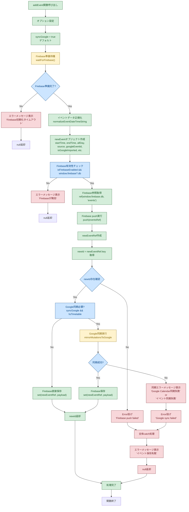

# 新規イベント追加の詳細フロー

## 概要

このフローチャートは、`addEvent` 関数における新規イベント追加の詳細な処理過程を示しています。トランザクション的な同期処理により、Google Calendar との同期が成功した場合のみイベントが Firebase に保存されます。

## フローの詳細説明

### 1. 初期化フェーズ
- **オプション設定**: `syncGoogle = true` (デフォルトでGoogle同期有効)
- **Firebase準備待機**: Firebase SDKの初期化完了を待機
- **イベントデータ正規化**: `startTime` と `endTime` の日時文字列を正規化
- **newEventオブジェクト作成**: イベントの全プロパティを設定（タイムスタンプ、クライアントIDなど）

### 2. Firebase 準備フェーズ
- **Firebase有効性チェック**: Firebaseが有効でデータベース参照が取得可能か確認
- **参照取得**: `events` パスのFirebase参照を取得
- **Push実行**: 新しいイベント用の参照を生成（キーは自動生成）
- **ID取得**: 生成されたFirebaseキー（`newId`）を取得

### 3. 同期判定フェーズ
- **同期必要判定**: Google同期が必要かチェック
  - `syncGoogle` が `true` かつ `isTimetable` が `false` の場合のみ同期実行
- **同期不要の場合**: 直接Firebaseに保存して終了

### 4. Google同期フェーズ（トランザクション的）
- **Google同期実行**: `mirrorMutationsToGoogle` でGoogle Calendarにイベントを同期
- **同期成功時**: Firebaseにイベントデータを保存
- **同期失敗時**: Firebaseに保存せず、エラーメッセージを表示して処理中断

### 5. エラーハンドリング
- **全体catch**: 予期せぬエラーをキャッチし、一般的なエラーメッセージを表示
- **同期固有エラー**: Google同期失敗時に具体的なエラーメッセージを表示

## 重要な特徴

1. **トランザクション性**: Google同期が成功した場合のみイベントが確定（Firebase保存）
2. **エラー分離**: 同期失敗時はFirebaseに保存されず、状態の一貫性が保たれる
3. **柔軟な同期制御**: オプションでGoogle同期を無効化可能
4. **詳細なエラーハンドリング**: エラーの種類に応じた適切なメッセージ表示

このフローにより、新規追加イベントは既存イベントと同じ「Google Calendar同期済み」状態を保証します。
