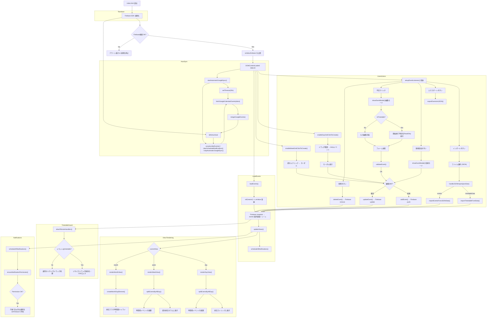
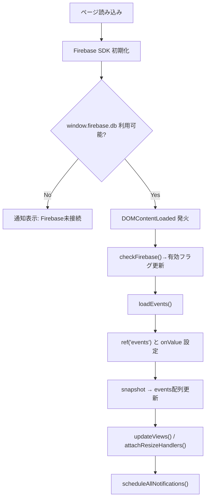
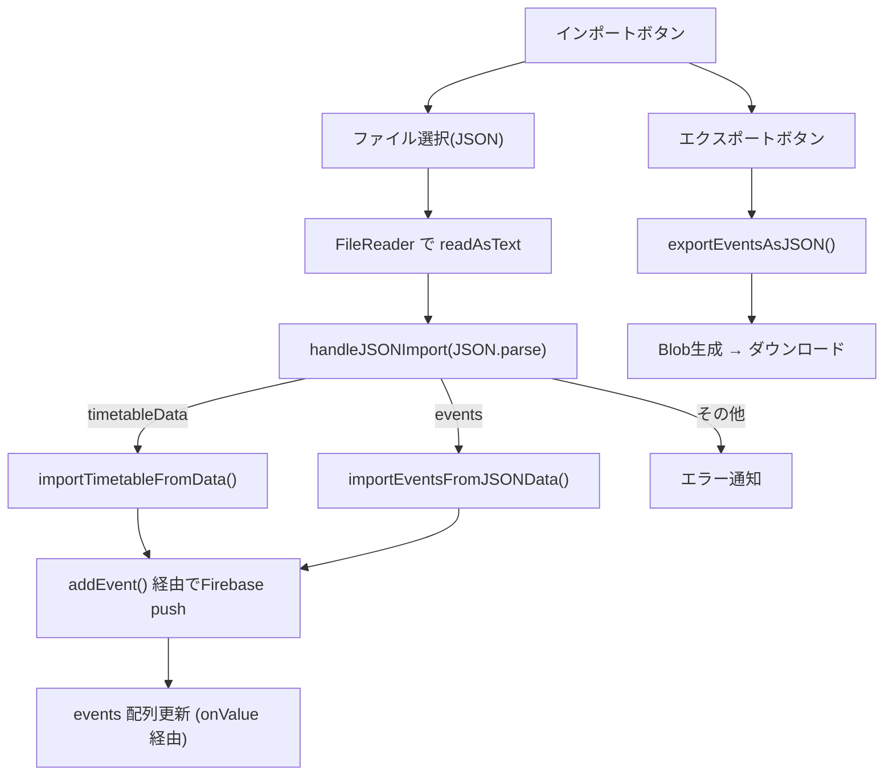
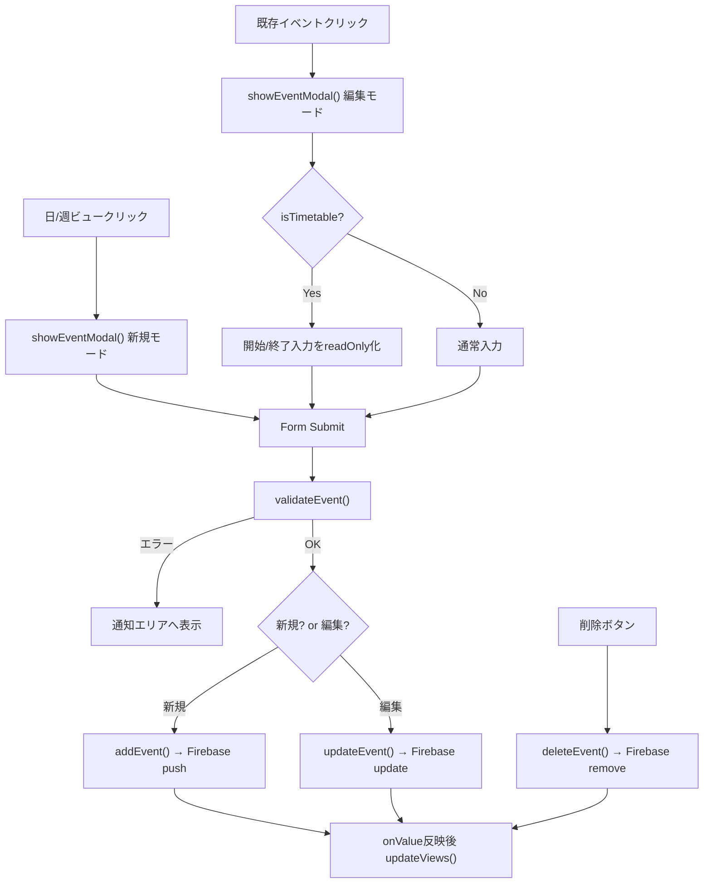
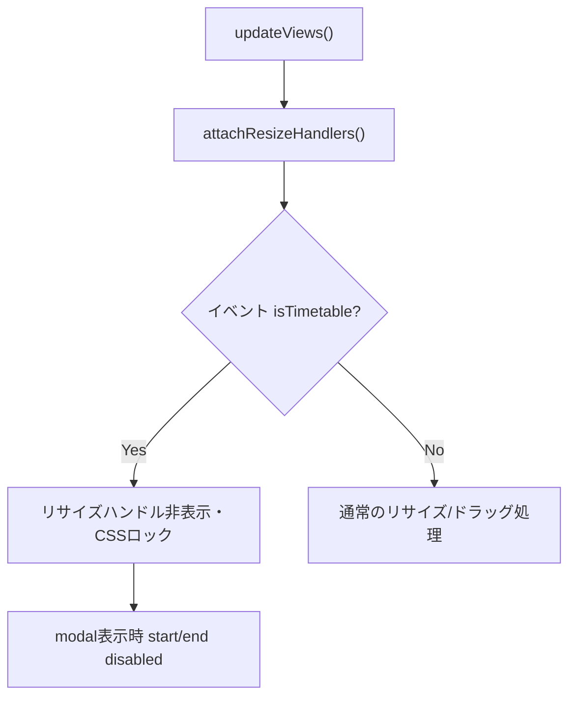
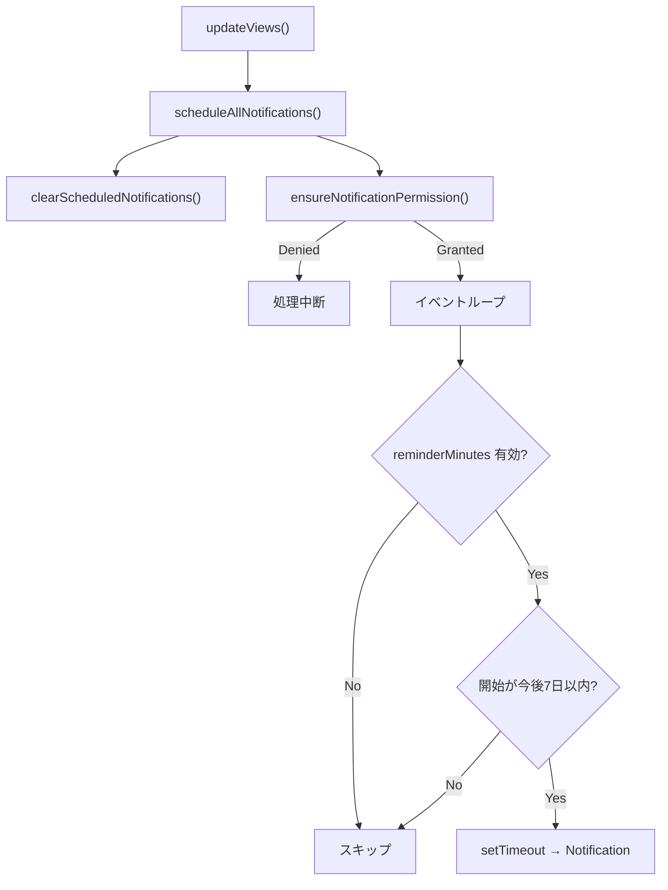
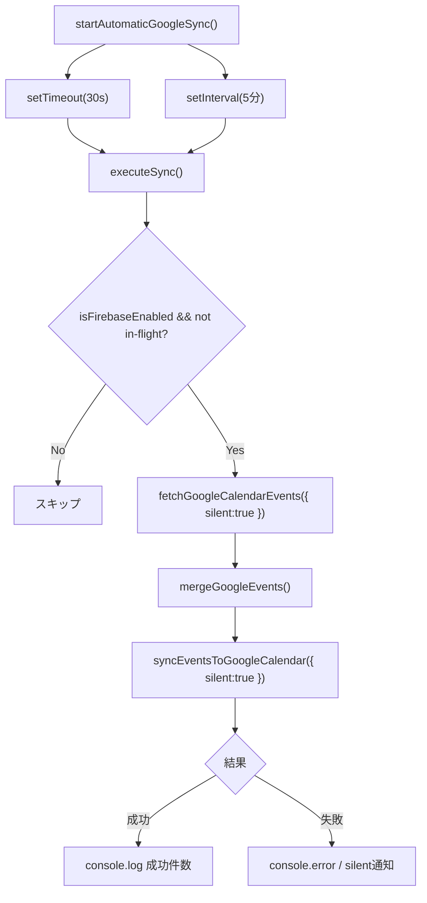
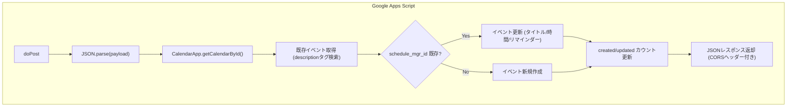

```mermaid
flowchart TD
    A["index.html 読込"] --> B["Firebase SDK 初期化"]
    B --> C{"Firebase接続 OK?"}
    C -->|Yes| D["window.firebase を公開"]
    C -->|No| E["アラート表示 & 初期化停止"]
    D --> F["DOMContentLoaded (app.js)"]

    F --> G["setupEventListeners() 登録"]
    F --> H["enableDayGridClickToCreate()"]
    F --> I["enableWeekGridClickToCreate()"]
    F --> J["loadEvents()"]

    subgraph LoadEvents
        J --> K["ref('events') へ onValue 登録"]
        K --> L["Firebase snapshot → events 配列更新 / ソート"]
        L --> M["updateViews()"]
        M --> N["scheduleAllNotifications()"]
    end

    subgraph View Rendering
        M --> O{"currentView"}
        O -->|day| P["renderDayView()"]
        P --> P1["splitEventsByAllDay()"]
        P1 --> P2["終日ストリップに表示"]
        P1 --> P3["時間帯イベントを配置"]
        O -->|week| Q["renderWeekView()"]
        Q --> Q1["splitEventsByAllDay()"]
        Q1 --> Q2["週次終日カラムに表示"]
        Q1 --> Q3["時間帯イベントを配置"]
        O -->|month| R["renderMonthView()"]
        R --> S["createMonthDayElement()"]
        S --> T["終日フラグ/時間割ハイライト"]
    end

    subgraph UserActions
        G --> U["インポートボタン"]
        U --> V["ファイル選択 (JSON)"]
        V --> W["handleJSONImport(jsonData)"]
        W -->|timetableData| X["importTimetableFromData()"]
        X --> L
        W -->|events| Y["importEventsFromJSONData()"]
        Y --> L

        G --> Z["エクスポートボタン"]
        Z --> AA["exportEventsAsJSON()"]

        G --> AB["新規追加ボタン"]
        AB --> AC["showEventModal() 新規モード"]
        G --> AD["予定クリック"]
        AD --> AE["showEventModal() 編集モード"]
        AE --> AF{"isTimetable?"}
        AF -->|Yes| AG["開始/終了時刻をReadOnly表示"]
        AF -->|No| AH["入力編集可能"]

        AI["フォーム送信"] --> AJ["validateEvent()"]
        AJ -->|OK| AK{"編集中ID?"}
        AK -->|新規| AL["addEvent() → Firebase push"]
        AK -->|既存| AM["updateEvent() → Firebase update"]
        AL --> L
        AM --> L

        G --> AN["削除ボタン"]
        AN --> AO["deleteEvent() → Firebase remove"]
        AO --> L

        H --> AP["ドラッグ範囲 → tempイベント"]
        AP --> AQ["モーダル表示"]
        AQ --> AK

        I --> AR["週セルクリック → モーダル"]
        AR --> AK
    end

    subgraph TimetableGuard
        L --> AS["attachResizeHandlers()"]
        AS --> AT{"イベントはtimetable?"}
        AT -->|Yes| AU["リサイズ/ドラッグ無効化・CSSロック"]
        AT -->|No| AV["通常のリサイズ/ドラッグ処理"]
    end

    subgraph Notifications
        M --> AW["scheduleAllNotifications()"]
        AW --> AX["ensureNotificationPermission()"]
        AX --> AY{"Permission OK?"}
        AY -->|Yes| AZ["今後7日以内の通知をsetTimeoutで予約"]
    end

    subgraph AutoSync
        F --> BA["startAutomaticGoogleSync()"]
        BA --> BB["setTimeout(30s)"]
        BB --> BC["fetchGoogleCalendarEvents(silent)"]
        BC --> BD["mergeGoogleEvents()"]
        BD --> BE["syncEventsToGoogleCalendar(silent)"]
        BA --> BF["setInterval(5分毎)"]
        BF --> BC
    end

    subgraph Teardown
        B --> BE["beforeunload"]
        BE --> BF["unsubscribeEvents() / clearScheduledNotifications() / stopAutomaticGoogleSync()"]
    end

    AC --> AK
    AG --> AI
    AH --> AI
```

### Firebase Initialization & Data Sync

```mermaid
flowchart TD
    A[ページ読み込み] --> B[Firebase SDK 初期化]
    B --> C{"window.firebase.db 利用可能?"}
    C -->|No| D["通知表示: Firebase未接続"]
    C -->|Yes| E["DOMContentLoaded 発火"]
    E --> F["checkFirebase()→有効フラグ更新"]
    F --> G["loadEvents()"]
    G --> H["ref('events') と onValue 設定"]
    H --> I["snapshot → events配列更新"]
    I --> J["updateViews() / attachResizeHandlers()"]
    J --> K["scheduleAllNotifications()"]
```

### インポート & エクスポート処理

```mermaid
flowchart TD
    A["インポートボタン"] --> B["ファイル選択(JSON)"]
    B --> C["FileReader で readAsText"]
    C --> D["handleJSONImport(JSON.parse)"]
    D -->|timetableData| E["importTimetableFromData()"]
    D -->|events| F["importEventsFromJSONData()"]
    D -->|その他| G["エラー通知"]
    E --> H["addEvent() 経由でFirebase push"]
    F --> H
    H --> I["events 配列更新 (onValue 経由)"]
    A --> J["エクスポートボタン"]
    J --> K["exportEventsAsJSON()"]
    K --> L["Blob生成 → ダウンロード"]
```

### 予定の作成・編集・削除フロー

```mermaid
flowchart TD
    A["日/週ビュークリック"] --> B["showEventModal() 新規モード"]
    C["既存イベントクリック"] --> D["showEventModal() 編集モード"]
    D --> E{"isTimetable?"}
    E -->|Yes| F["開始/終了入力をreadOnly化"]
    E -->|No| G["通常入力"]
    B --> H["Form Submit"]
    F --> H
    G --> H
    H --> I["validateEvent()"]
    I -->|エラー| J["通知エリアへ表示"]
    I -->|OK| K{"新規? or 編集?"}
    K -->|新規| L["addEvent() → Firebase push"]
    K -->|編集| M["updateEvent() → Firebase update"]
    L --> N["onValue反映後 updateViews()"]
    M --> N
    O["削除ボタン"] --> P["deleteEvent() → Firebase remove"]
    P --> N
```

### 時間割イベントのロック処理

```mermaid
flowchart TD
    A["updateViews()"] --> B["attachResizeHandlers()"]
    B --> C{イベント isTimetable?}
    C -->|Yes| D["リサイズハンドル非表示・CSSロック"]
    C -->|No| E["通常のリサイズ/ドラッグ処理"]
    D --> F["modal表示時 start/end disabled"]
```

### 通知 API スケジューリング

```mermaid
flowchart TD
    A["updateViews()"] --> B["scheduleAllNotifications()"]
    B --> C["clearScheduledNotifications()"]
    B --> D["ensureNotificationPermission()"]
    D -->|Denied| E["処理中断"]
    D -->|Granted| F["イベントループ"]
    F --> G{reminderMinutes 有効?}
    G -->|No| H["スキップ"]
    G -->|Yes| I{開始が今後7日以内?}
    I -->|No| H
    I -->|Yes| J["setTimeout → Notification"]
```

### Google カレンダー自動同期 (フロントエンド)

```mermaid
flowchart TD
    A["startAutomaticGoogleSync()"] --> B["setTimeout(30s)"]
    A --> C["setInterval(5分)"]
    B --> D["executeSync()"]
    C --> D
    D --> E{"isFirebaseEnabled && not in-flight?"}
    E -->|No| F["スキップ"]
    E -->|Yes| G["fetchGoogleCalendarEvents({ silent:true })"]
    G --> H["mergeGoogleEvents()"]
    H --> I["syncEventsToGoogleCalendar({ silent:true })"]
    I --> J{"結果"}
    J -->|成功| K["console.log 成功件数"]
    J -->|失敗| L["console.error / silent通知"]
```

```mermaid
flowchart TD
    subgraph Google Apps Script
        A["doPost"] --> B["JSON.parse(payload)"]
        B --> C["CalendarApp.getCalendarById()"]
        C --> D["既存イベント取得 (descriptionタグ検索)"]
        D --> E{"schedule_mgr_id 既存?"}
        E -->|Yes| F["イベント更新 (タイトル/時間/リマインダー)"]
        E -->|No| G["イベント新規作成"]
        F --> H["created/updated カウント更新"]
        G --> H
        H --> I["JSONレスポンス返却 (CORSヘッダー付き)"]
    end
```

