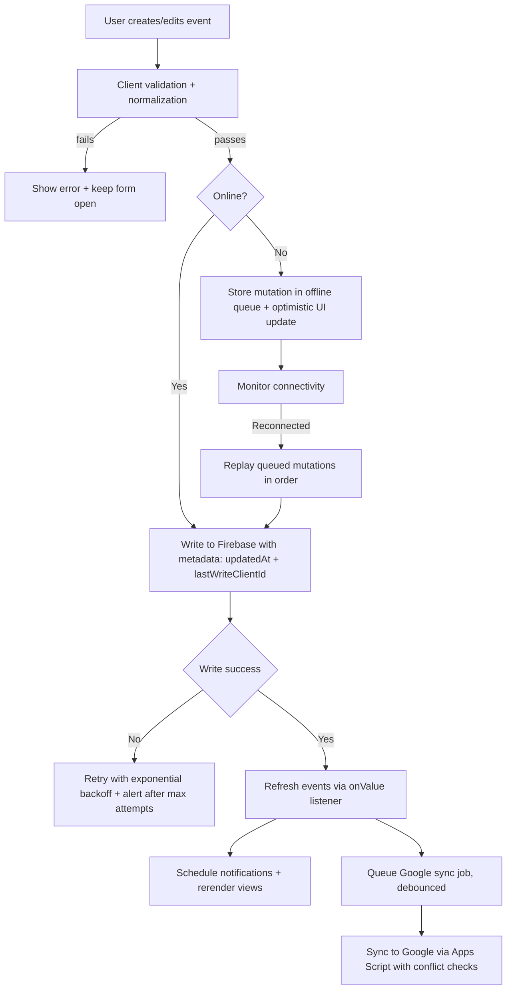

## Reliability Logic Enhancements

- **Input validation & normalization** before persisting ensures malformed events (e.g., invalid ranges or malformed recurrence rules) never reach Firebase or Google sync.
- **Optimistic UI with offline queue** lets users keep working while connectivity is lost; queued mutations replay once Firebase reconnects.
- **Conflict detection** compares `updatedAt`/`lastWriteClientId` so the app prompts on concurrent edits rather than silently overwriting.
- **Retry with backoff** wraps network operations (Firebase writes, Google Apps Script calls) to avoid data loss on transient failures.
- **Integrity checks** (hash or schema version) run after imports and before exports to catch corrupted payloads early.

